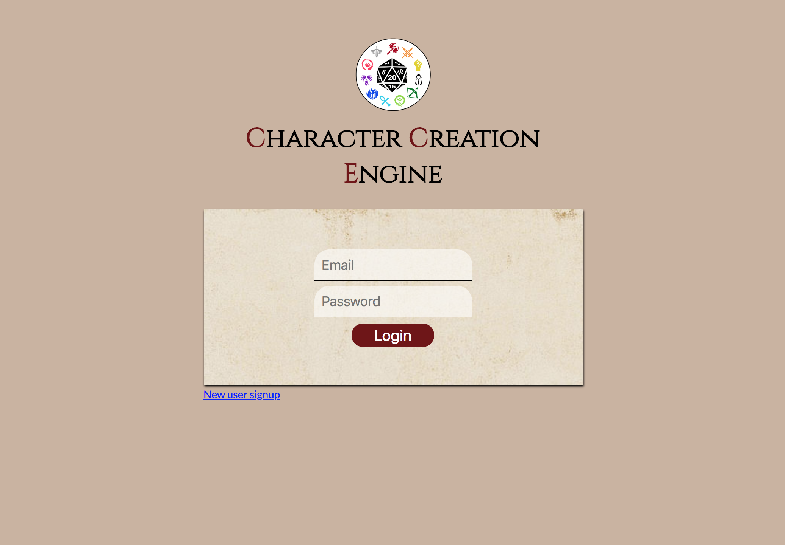
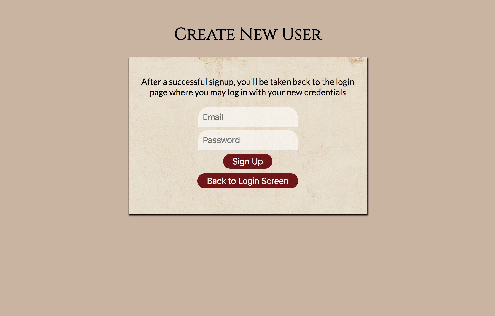
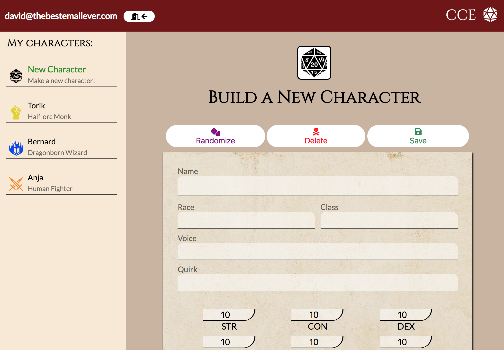
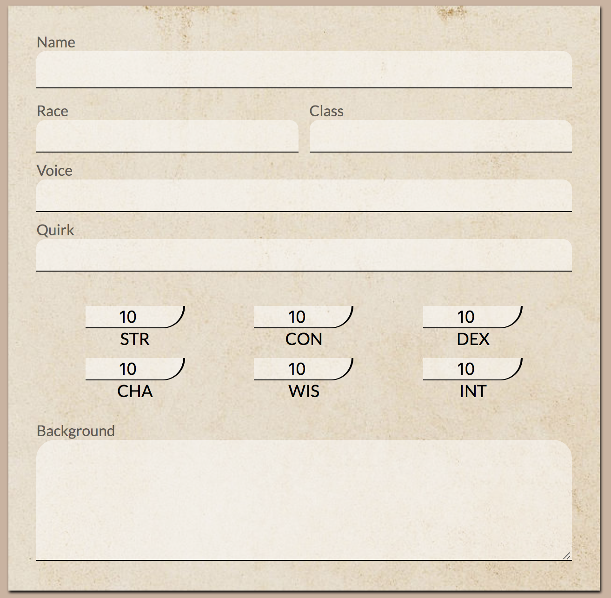

# Charcter Creation Engine
## for DnD 5e

CCE is a great jumping-off point for players creating a new character, or dungeon masters who need to fill out their list of interesting NPCs. Once a user signs up and logs in, they are immediately greeted with the character build page where they can start building new characters. To get a random character, hit the "Randomize" button at the top-left and all the character fields will be filled with a random value. You may also customize these values, and then click the "Save" button once you're happy with your character. The character will be saved in your profile and added to the list in the sidebar, and the build page will be cleared and ready for new inputs. If you want to generate a new random character, hit the blue "New Character" button at the top of the sidebar. A new randomly-generated character will appear in the build page, ready for editing. Save this new character to your list by clicking the "Save" button. To change or delete any characters you have already made, just click on the relevant character in the sidebar to open them up in the build page. Then you may edit them (be sure to click "Save" afterwards!), or delete them by clicking "Delete" at the top. When you're done making characters, you can click the white Logout button at the top-left of the sidebar - your saved characters will be waiting for you!

### Live demo:

link

Test account credentials: 
email: test@test.com
pass: tester

Include: 
Dependencies section
How to get the app up and running if it gets pulled down (install node, run npm start, )
Testing section (commands to run to test the app)

To find out: clone app into new directory, go through all steps to get it running, document those steps

### Screenshots

Title/login screen:

New User Signup screen:

Character Build screen:

Full Character Options Sheet:

### Built With

- jQuery
- Node.js
- Express
- Mocha/Chai
- TravisCI
- MongoDB